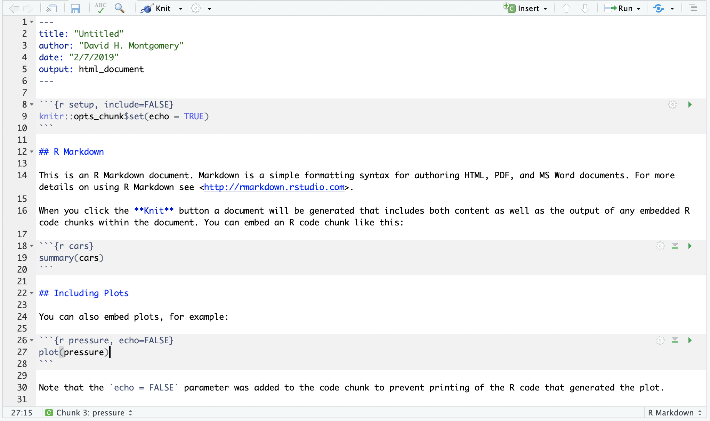
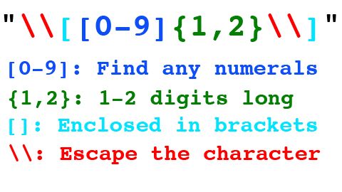

```{r setup, include=FALSE, eval = TRUE}
knitr::opts_chunk$set(echo = TRUE, message = FALSE, warning = FALSE, eval = FALSE)
library(tidyverse) # All sorts of vital tools
library(scales) # Helps make our ggplot graphs prettier
library(stringr) # Tools for cleaning up text
library(rvest) # Tools for scraping
```

In this lesson we're going to learn how to use R to download data directly from webpages — or "scrape" — and how to clean that inevitably messy data. You can work through this lesson simply by copying and pasting code, but some basic knowledge of R syntax and tidyverse syntax (such as the `%>%`) will make this a lot more useful. 

Why scrape in R?

- Sometimes it's the **only** way to get data
- Sometimes it's the **easiest** way to get data (much better than extensive copying and pasting)
- Sometimes it's the **best** way to get the data (a reproducible workflow!)

## Getting started

In RStudio, go to `File -> New Project`. What we're going to do here is create a special project file in RStudio that will keep all your data and preferences for this project in one place. It's most useful because it sets your working directory to the project folder — you'll never have to deal with `setwd()` again. (Projects also let you have several instances of RStudio open at the same time, which we won't need today, but can really come in handy down the road.)

Click `New Directory` and then `New Project`. Use `Browse` to find where you want to put your directory, and then type a directory name — perhaps `r3` or `r3` followed by your last name. Check `Open in a new session` and click `Create Project`. 

Now, open up a new R Markdown document by going to `File -> New File -> R Markdown`. 

If you're not familiar with R Markdown, you'll get a popup window with a bunch of options. You can leave most of them as the defaults for now. Type your name under "Author" and whatever you want as the "Title" — you can always change it later. Click OK. You should see something like this:



In R Markdown, you can write normal text using the [Markdown](https://en.wikipedia.org/wiki/Markdown) syntax that helps run Github, Reddit and lots of other parts of the Internet. You can also write code chunks that you can execute one by one. RStudio has pre-populated a document for you with some sample text and a few sample code chunks. 

At the very top is one labeled `setup`. Here you can define options for the document — the only one here, `ECHO = TRUE`, means that the document will show your code as well as the code's output when you make the document — and it's also a really good place to load all your packages. Let's load a few packages to start — type or paste these in your setup chunk, below the `knitr::opts_chunk$set(echo = TRUE)` line:

```{r}
knitr::opts_chunk$set(echo = TRUE)
library(tidyverse) # All sorts of vital tools
library(scales) # Helps make our ggplot graphs prettier
library(stringr) # Tools for cleaning up text
library(rvest) # Tools for scraping
```

By clicking the little green arrow in the upper right corner of your chunk, you can run all the code in that chunk — and no other code — at once. You can also type Cmd-Shift-Enter (on a Mac) or Ctrl-Shift-Enter (on a PC) to run the chunk your cursor is in. 

Save your R Markdown document in your project directory.

## The really easy way to scrape data.

Sometimes, if you're lucky, your data is nice and clean and online already. All you need to do is download it. You COULD do that in your browser. But it's also really easy to do via code. 

It works like this:

```{r}
ssa <- read_csv("https://www.ssa.gov/disability/data/SSA-SA-FYWL.csv")
```

```{r eval = FALSE}
https://raw.githubusercontent.com/rdrr1990/bigKRLS/master/examples/data2016GE.csv
```

That's right — `read_csv()` will work on URLs as well as files saved to your desktop! So as long as you know the URL of a CSV — and are reasonably confident the URL is stable — you don't need to download the file to your hard drive, you can just load it from the command line. 

Open up a new code chunk in R Markdown by clicking "Insert -> R" in the top bar, or "Insert Chunk" from the "Code" menu, or by typing the three backticks, `{r}`, and then three new backticks on a new line. (You can also name your chunk by typing a word after the `r` inside the braces, separated by a space.) Then paste that code in and run the chunk.

But let's say you *want* to download the file to your hard drive, maybe to have it as a backup. No need to open up a browser for that, either! 

```{r}
download.file(url = "https://www.ssa.gov/disability/data/SSA-SA-FYWL.csv",
			  destfile = "SSA-SA-FYWL.csv")
```

That downloaded the file to your current working directory. So now you can just run:

```{r}
ssa <- read_csv("SSA-SA-FYWL.csv")
```

And the file you downloaded will load.

What if your file is included in a ZIP? Again, stay in RStudio.

```{r}
dir.create("testdata") # Creates a new folder in your working directory
download.file(url = "http://api.worldbank.org/v2/en/country/gbr?downloadformat=csv",
			  destfile = "testdata/testzip.zip") # Downloads the ZIP to that folder
unzip("testdata/testzip.zip",
	  exdir = "testdata") # Unzips the data
dir("testdata") # Looks at the files in our directory.
testdata <- read_csv("testdata/API_GBR_DS2_en_csv_v2_10402095.csv") # Load the data in
file.remove("testdata/testzip.zip") # Remove the unneeded ZIP
```

We can even get cleaner than that, using an R tool called temporary directories.

```{r}
temp <- tempfile() # Creates a temporary file and stores a link to it in R in the object `temp`
download.file(url = "http://api.worldbank.org/v2/en/country/gbr?downloadformat=csv",
			  destfile = temp)
unzip(temp, exdir = "testdata2")
```

Here we downloaded our ZIP to a temporary file and unzipped it to a folder. You'll also notice we didn't create this folder in advance! We told R to unzip our data to a folder that didn't exist, so R created it and unzipped there. 

## Getting messy

Unfortunately, real-world data often isn't packaged neat and tidy for us in a structured CSV. Sometimes we have to go out and get it. Fortunately, R has lots of tools for doing that, as well.

For this demo, we're going to use a table from Wikipedia — the page of [World Series television ratings](https://en.wikipedia.org/wiki/World_Series_television_ratings) — but the same process can work on just about any messy HTML table. 

First, open up that page in Chrome and scroll down. We can see the table we want is titled "Television ratings by year, 1984 – present." Take a look at it. Note the messiness — we've got multiple pieces of data in single cells, we've got split cells, footnote citations, an entire year of missing data. So this is going to be fun! But also surprisingly easy.

We need one piece of information from our web browser before we can go back to our command line — something called the `XPath`. You can [look up what this means in detail](https://en.wikipedia.org/wiki/XPath) if you want, but what you really need to know is that every element on the page has a unique XPath code. That's what we're going to use to tell R what to scrape.

Right-click on the table and choose "Inspect." The inspection palette will appear, showing the page's source code. Scroll through that until you find the start of the table, which should say `<table class="wikitable">`. Right-click IT, choose  `Copy -> Copy XPath`. Now go back to RStudio and paste it in to your R Markdown: `//*[@id="mw-content-text"]/div/table[2]`.

Great. We'll come back to that in a second.

Open up a new code chunk. You might give it a name like `scrape`. We're going to start out by saving our URL — the whole page URL — as an object.

```{r eval = TRUE}
url <- "https://en.wikipedia.org/wiki/World_Series_television_ratings"
```

Now here comes the fun part. We're going to build our scraper line-by-line, using functions from the `rvest` package along with `tidyverse` stuff.

```{r}
ratings <- read_html(url) # Start with our URL and read its HTML into R
```

Let's inspect this. It's not much use. So we keep going, using our XPath snippet:

```{r}
ratings <- read_html(url) %>%
	html_nodes(xpath='//*[@id="mw-content-text"]/div/table[2]') # Point to the right table on the page via its xpath ID
	# Note that the xpath contains qutation marks, so we use single quotes to create this string
```

This looks a little more useful — we've now narrowed down our page to just our one particular section, the table. And we can see the HTML structure by looking at it. But we can't do anything with this... yet.

```{r}
ratings <- read_html(url) %>%
	html_nodes(xpath='//*[@id="mw-content-text"]/div/table[2]') %>% # Point to the right table on the page via its xpath ID
	html_table(fill = TRUE)# Fill out any missing cells 
```

Now if you open up `ratings` you can see we've got actual data! `html_table()` parsed through all that HTML and converted it into an R data frame. But it's stuck inside a list, so we'll need to extract it:

```{r eval = TRUE}
ratings <- read_html(url) %>%
	html_nodes(xpath='//*[@id="mw-content-text"]/div/table[2]') %>% # Point to the right table on the page via its xpath ID
	html_table(fill = TRUE) %>% # Fill out any missing cells 
	`[[`(1) # Extract the data frame from the list created above
```

That's a weird little bit of notation, which is basically the equivalent of `ratings <- ratings[[1]]`. But this way we don't need to interrupt our code but can keep building up a structure using `%>%`. 

So now, congratulations. Click on `ratings` and take a look — you've successfully scraped a table off the web. All you need to do is follow a few key steps:

1. Use `read_html()` on your URL to load in the HTML
2. Use `html_nodes(xpath = 'XPATH/HERE')` with your Xpath to point R to the right part of the page
3. Use `html_table()` to extract your table from the HTML
4. Extract your data frame from a list. 

Of course, scraping is usually only the first part of the battle. Our data frame is pretty messy. Which means it's time for us to...

## Clean

Take a look at the structure of our data frame. We've got columns for year and broadcast network for each World Series, the results of that series, the average ratings for the whole series, and individual ratings for each game of the series, always between four and seven. If a game wasn't played, the cell says "No Game".

We've got a lot of mess to clean up, so we've got to just pick somewhere to start. We'll start with some easy stuff:

```{r}
ratings_clean <- ratings %>%
	filter(Results != "Canceled due to the MLB strike") %>% # Remove the cancelled 1994 World Series
	select(-`Avg.`) # Drop average column
```

That was pretty simple. Filter out a row we don't need, and select out a column we don't need.

Now we're going to use `tidyr`'s `gather()` function to reshape the data. Instead of a column for each possible game, we want to have a single column for game ratings, with each year-game combination having its own row. This is also really easy, thanks to the magic of the tidyverse:

```{r}
ratings_clean <- ratings %>%
	filter(Results != "Canceled due to the MLB strike") %>% # Remove the cancelled 1994 World Series
	select(-`Avg.`) %>% # Drop average column
	gather(key = "game", value = "viewers", 4:10) # Reshape data
```

Here we're telling it to take columns 4-10 of the dataframe and reshape them. Our column headers will become a new sorting column called `game`, while the contents of those cells will go in a column called `viewers`. 

(If you wanted to go the other way, you can use the `spread()` function:

```{r}
ratings_clean <- ratings %>%
	filter(Results != "Canceled due to the MLB strike") %>% # Remove the cancelled 1994 World Series
	select(-`Avg.`) %>% # Drop average column
	gather(key = "game", value = "viewers", 4:10) %>% # Reshape data
	spread(key = game, value = viewers) # Spread the data back out
```

The only real difference is that here our `key` and `value` are unquoted, because we're referring to actual existing columns and not telling R what to name them. Also we don't need to specify column numbers because we've already told it the two columns we're working on.)

So now we've got a nice, tall dataframe, with all the mess confined to a single column, `viewers`. Let's clean it up!

First, let's get rid of all those "No Game" rows.

```{r}
ratings_clean <- ratings %>%
	filter(Results != "Canceled due to the MLB strike") %>% # Remove the cancelled 1994 World Series
	select(-`Avg.`) %>% # Drop average column
	gather(key = "game", value = "viewers", 4:10) %>% # Reshape data
	filter(viewers != "No Game") # Remove "No Game" rows
```

Now, we're going to deal with two new things here to keep cleaning.

One is a function from the `stringr` package called `str_remove_all()`. This goes through a body of text and removes phrases we want out. It's got a pretty basic structure: `str_remove_all(string, pattern)`. 

In this case, the `string` we want it to act on is our column, `viewers`. As for the `pattern`, this CAN be really simple. For example, you could use it to remove all occasions of ` Mviewers`:

```{r}
ratings_clean <- ratings %>%
	filter(Results != "Canceled due to the MLB strike") %>% # Remove the cancelled 1994 World Series
	select(-`Avg.`) %>% # Drop average column
	gather(key = "game", value = "viewers", 4:10) %>% # Reshape data
	filter(viewers != "No Game") %>% # Remove "No Game" rows
	mutate(viewers = str_remove_all(viewers, pattern = " Mviewers")) # Remove text
```

Here, we told it to find all occasions of " Mviewers" in our column and delete it. Easy peasy.

But what we want to do is use this to zap all these footnotes, which range from "[3]" up to about "[37]". We could go through and `str_remove_all()` on each possible number one by one, but we learned code to avoid having to do repetitive stuff like that. So brace yourselves, because we're going to dip our toes in to regex.

Regex, or "[regular expressions](https://en.wikipedia.org/wiki/Regular_expression)", are a powerful but complicated way to programmatically select and manipulate text data. This isn't a class on regex, so I'm not going to go into a ton of detail about it, but it's really helpful in cleaning up data, and you don't have to be an expert — I certainly am not; I Google or use trial-and-error just about every time I work with it — to get a lot of use out of it.

Regex is going to let us search through our column for every time a number is enclosed in square brackets, and delete it. I'll show it to you, and then explained how that worked: 

```{r}
ratings_clean <- ratings %>%
	filter(Results != "Canceled due to the MLB strike") %>% # Remove the cancelled 1994 World Series
	select(-`Avg.`) %>% # Drop average column
	gather(key = "game", value = "viewers", 4:10) %>% # Reshape data
	filter(viewers != "No Game") %>% # Remove "No Game" rows
	mutate(viewers = str_remove_all(viewers, pattern = " Mviewers")) %>% # Remove text
	mutate(viewers = str_remove_all(viewers, pattern = "\\[[0-9]{1,2}\\]")) # Remove footnoted brackets with regex magic
```

Here's what that means:



(Note that most flavors of regex use a single backslash, `\`, to escape characters — that is, to tell regex that your brackets or parentheses or whatever in your code represent actual text, and not the functional use that those characters have in a regular expression. R, for whatever reason, uses two backslashes (`\\`) to escape characters.)

In any case, take a look at `ratings` — the footnotes are gone! We're in the homestretch now. Our big remaining problem now is that the `viewers` column has a bunch of different data types in it. Fear not — `separate()` is coming to the rescue!

```{r}
ratings_clean <- ratings %>%
	filter(Results != "Canceled due to the MLB strike") %>% # Remove the cancelled 1994 World Series
	select(-`Avg.`) %>% # Drop average column
	gather(key = "game", value = "viewers", 4:10) %>% # Reshape data
	filter(viewers != "No Game") %>% # Remove "No Game" rows
	mutate(viewers = str_remove_all(viewers, pattern = " Mviewers")) %>% # Remove text
	mutate(viewers = str_remove_all(viewers, pattern = "\\[[0-9]{1,2}\\]")) %>% # Remove footnoted brackets with regex magic
	separate(viewers, sep = "/", into = c("rating", "share"), convert = TRUE) # Separate on the "/"
```

Here we told R to take our `viewers` column and to split its contents into multiple columns, using a `/` as the separator. We named our new columns `rating` and `share` (since the first number in the rating is the "rating" or percent of active TVs watching an event, and the second is the "share" or percent of all TVs, on or off, watching the event). We told R to check after it did this if any of the new columns should be of a different type, and if so convert them — so if you check, you see our `rating` column is now numeric rather than text! No need for a separate mutate.

Now we just need to use `separate()` a few more times.

```{r}
ratings_clean <- ratings %>%
	filter(Results != "Canceled due to the MLB strike") %>% # Remove the cancelled 1994 World Series
	select(-`Avg.`) %>% # Drop average column
	gather(key = "game", value = "viewers", 4:10) %>% # Reshape data
	filter(viewers != "No Game") %>% # Remove "No Game" rows
	mutate(viewers = str_remove_all(viewers, pattern = " Mviewers")) %>% # Remove text
	mutate(viewers = str_remove_all(viewers, pattern = "\\[[0-9]{1,2}\\]")) %>% # Remove footnoted brackets with regex magic
	separate(viewers, sep = "/", into = c("rating", "share"), convert = TRUE) %>% # Separate on the "/"
	separate(share, sep = "\\(", into = c("share", "viewers"), convert = TRUE) %>% # Separate on the open parentheses
	separate(viewers, sep = " ", into = c("viewers"), extra = "drop", convert = TRUE) # Separate on the first space, dropping extras
```

Note our use of `extra = "drop"` — that told R to separate `viewers` into columns based on a space, but just to create one new column and drop any extra text. We only wanted the stuff before the first space.

Also note how we used double backslashes `\\` to escape the parenthesis. Otherwise R would have thought we wanted to use that parenthesis as part of a regular expression.

We've got a bit of tweaking to do. If you look at Game 7 of the 1986 World Series, you'll notice that its ratings were given as a range instead of a single number. We can just use `separate()` again to clean that up, just like we did before.

We can also edit our `" Mviewers"` string removal to catch that closing parenthesis. Note that we need to escape it!

```{r eval = TRUE}
ratings_clean <- ratings %>%
	filter(Results != "Canceled due to the MLB strike") %>% # Remove the cancelled 1994 World Series
	select(-`Avg.`) %>% # Drop average column
	gather(key = "game", value = "viewers", 4:10) %>% # Reshape data
	filter(viewers != "No Game") %>% # Remove "No Game" rows
	mutate(viewers = str_remove_all(viewers, pattern = " Mviewers\\)")) %>% # Remove text
	mutate(viewers = str_remove_all(viewers, pattern = "\\[[0-9]{1,2}\\]")) %>% # Remove footnoted brackets with regex magic
	separate(viewers, sep = "/", into = c("rating", "share"), convert = TRUE) %>% # Separate on the "/"
	separate(share, sep = "\\(", into = c("share", "viewers"), convert = TRUE) %>% # Separate on the open parentheses
	separate(viewers, sep = " ", into = c("viewers"), extra = "drop", convert = TRUE) %>% # Separate on the first space, dropping extras
	separate(viewers, sep = "\\–", into = c("viewers"), extra = "drop", convert = TRUE) # One year's rating was given as a range. Take the lower number
```

If we wanted to take the higher number instead, we had a couple of options. We could use regex to search for numbers before a dash and delete them. Or we could have split it into an `overflow` column and then used conditionals to replace the original. It was easier, I think you'll agree, to take the lower number.

Anyway, that's it! Take a look at our nice clean dataset. If we wanted to, we can easily graph it:

```{r eval = TRUE, fig.width = 10}
ggplot(ratings_clean, aes(Year, viewers)) +
	geom_point(size = 2) + # No smoothing surve. No colors
	labs(title = "World Series ratings (1984-present)",
		 subtitle = "By David H. Montgomery, dhmontgomery.com",
		 caption = "Data from wikipedia.org/wiki/World_Series_television_ratings",
		 y = "Millions of viewers") +
	theme_bw() +
	facet_wrap(vars(game), nrow = 1) # Facet the chart by game
```

Now we can easily see some big trends: ratings have tended to go down over time, and later games in the Series tend to draw bigger ratings. (We can also see the huge ratings drawn by the greatest Game 7 of all time, 2016, not that I'm biased.)

## Another example

Minnesota's Secretary of State [posts current voter registration totals by county](https://www.sos.state.mn.us/election-administration-campaigns/data-maps/voter-registration-counts/) in an HTML table. Let's scrape it.

Try and use the technique you used above to scrape this table. I'll show you the code to do so below.

## Power cleaning with `janitor`

The `janitor` package has a lot of helpful functions for cleaning data:

- `clean_names()` fixes weirdly formatted column names
- `remove_empty()` can instantly remove all empty columns or empty rows from your spreadsheet, depending on the parameters you give it
- `excel_numeric_to_date()` creates actual dates out Excel's numeric dates, like `42370`
- `get_dupes()` produces a subset of duplicate rows that you can examine
- `convert_to_NA()` converts strings you specify into actual `NA` values.

## Returning to Minnesota

```{r mn_scrape}
url <- "http://www.sos.state.mn.us/election-administration-campaigns/data-maps/voter-registration-counts/" # Set the URL
mnvoterreg <- url %>% # Start with the URL
	read_html() %>% # Download the page's HTML
	html_nodes(xpath='//*[@id="highlightSearchText"]/div/table') %>% # Get just the table we want, with its xpath
	html_table(fill = TRUE) %>% # Convert to a table
	`[[`(1) # Extract the data frame from the list created above
```

Now how would you clean that? 

In this case, there's only one thing we need to do — the numbers here have commas, so we need to remove those and convert to numeric.

```{r}
mnvoterreg <- mnvoterreg %>% 
	janitor::clean_names() %>% # If you don't have janitor installed, use the next line:
	# set_names("county", "registered_voters") %>% 
	mutate(registered_voters = str_remove_all(registered_voters, ",") %>% as.numeric())
```

I wrote a script using this that I would then pull into other projects — every time I needed to know the current number of registerd voters in a county for some graph, I'd just run `mnvoterreg.r` and it would instantly plop this data frame into my environment. 

## Want a real challenge?

Try [this Wikipedia table of all U.S. presidents](https://en.wikipedia.org/wiki/List_of_Presidents_of_the_United_States). Easy to scrape — but a huge pain to clean!

The `xpath` is `//*[@id="mw-content-text"]/div/table[2]`. Have fun! 

```{r pres, include = FALSE, eval = FALSE}
url <- "https://en.wikipedia.org/wiki/List_of_Presidents_of_the_United_States"
presidents <- read_html(url) %>%
	html_nodes(xpath = '//*[@id="mw-content-text"]/div/table[2]') %>%
	html_table(fill = TRUE, header = FALSE) %>%
	`[[`(1)

# Clean
presidents1 <- presidents %>% 
	set_names("order", "term", )
	slice(-1:-2) # Remo
```

```{r include = FALSE, eval = FALSE}
library(jsonlite)
deaths <- data.frame()
for(i in 2017:2018) { # Cycle through each year using Wikipedia's API
    deathyear <- i
    cont <- "page%7C27273d3757274107044b2f4133273703424b2f413327370427273d375727410122018f7e8f808f808f0a%7C9346268" # Store a unique field Wikipedia's API uses to move between blocs of responses when you query it.
    deathscode <- expression(fromJSON(paste0("https://en.wikipedia.org/w/api.php?action=query&format=json&list=categorymembers&continue=-%7C%7C&cmtitle=Category%3A",deathyear,"_deaths&cmnamespace=0&cmlimit=max&cmcontinue=",cont))) # Generate the API query
    deathsapi <- eval(deathscode) # Evaluate the API query
    tmp <- deathsapi$query$categorymembers # Extract the result we want
    while(!is.null(deathsapi$continue$cmcontinue)) { # Keep cycling until we run out of new responses
        cont <- deathsapi$continue$cmcontinue # Store the new continuation variable
        deathsapi <- eval(deathscode) # Evaluate the new API query with our new `cont` value.
        tmp <- rbind( # Store it in a temporary dataframe.
            tmp,
            deathsapi$query$categorymembers)
    }
    tmp$year <- deathyear # Add a column marking the year.
    deaths <- rbind(deaths,tmp) # Add the temporary data to the full data.
} # Repeat the cycle
#9:27 am
deaths <- sample_n(deaths, 100)
for(i in 1:nrow(deaths)) { # Cycle through the list of deaths
    deaths$bytes[i] <- fromJSON(paste0("https://en.wikipedia.org//w/api.php?action=query&format=json&prop=revisions&rvprop=size&pageids=",deaths[i,1]))$query$pages[[1]][[4]] # Look up the article in the API from the page ID, take its length in bytes, and store it in a new 'bytes' column.
}
deaths$bytes <- as.numeric(deaths$bytes)
```